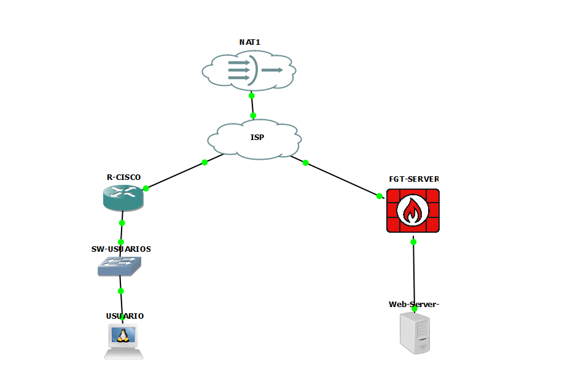

# Infraestructura 3 — Seguridad de Redes

**Estudiante:** José Miguel Díaz Ferreras  
**Matrícula:** 2025-0693

## Video demostrativo

**YouTube:** https://youtu.be/jYg-XXMeUyQ

## Objetivo

La infraestructura implementa una separación entre servicios públicos y acceso administrativo privado:

- El servicio **HTTPS** del Web-Server puede utilizarse sin establecer la VPN.
- El acceso **SSH** directo al servidor está restringido.
- El acceso **SSH** se habilita mediante una **VPN IPsec Remote Access** terminada en FortiGate.
- La red de usuarios utiliza **VLAN 10**, DHCP y NAT/PAT mediante Cisco.
- El servidor se encuentra en la red `10.6.93.128/28`.

## Topología

`USUARIO → SW-USUARIOS → R-CISCO → ISP → FGT-SERVER → Web-Server`

Direcciones principales:

| Segmento | Direccionamiento |
|---|---|
| Usuarios / VLAN 10 | `10.6.93.0/25` |
| R-CISCO ↔ ISP | `200.6.93.0/30` |
| ISP ↔ FortiGate | `200.6.93.4/30` |
| Servidores | `10.6.93.128/28` |
| Pool VPN | `10.6.93.193 - 10.6.93.206` |

## Validación funcional

| Prueba | Resultado |
|---|---|
| HTTPS a `200.6.93.6:443` sin VPN | Correcto |
| SSH a `10.6.93.130:22` sin VPN | Bloqueado / timeout |
| Establecimiento VPN IPsec | Correcto |
| IP virtual del cliente VPN | `10.6.93.193/32` |
| SSH a `10.6.93.130` con VPN | Correcto |

## Estructura del repositorio

- `configuraciones/` — running-configs y configuraciones sanitizadas de Cisco, FortiGate, strongSwan y servidor.
- `documentos/` — documento técnico final en DOCX y PDF.
- `evidencias/` — capturas de las validaciones realizadas.
- `scripts-lab/` — scripts Bash utilizados para las pruebas del laboratorio.
- `SEGURIDAD.md` — manejo de credenciales y secretos.

## Seguridad

El repositorio **no contiene contraseñas ni PSK reales**. Los archivos de ejemplo utilizan marcadores y la configuración de FortiGate está sanitizada.

> Nota: los algoritmos DES/SHA1 utilizados corresponden a la compatibilidad del laboratorio y no constituyen una recomendación para producción.
